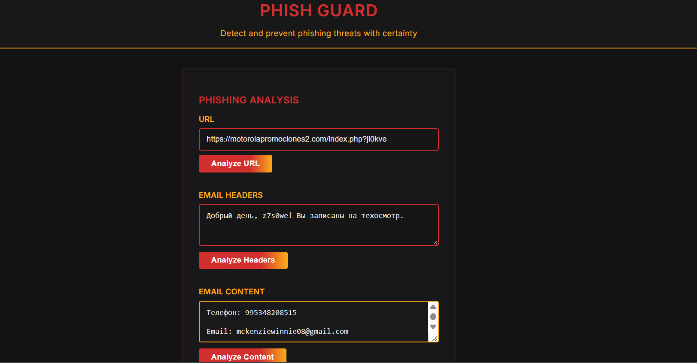

# Phish Guard

**Phish Guard** is a critical, vigilant, and professional website for detecting phishing attempts through analysis of URLs, email headers, and email content. Designed for security professionals and cautious users, it provides instant, detailed, and observant feedback on potential threats using a strict set of detection heuristics.

## Features

- **Professional, Alert Design:**  
  Dark theme with red, yellow, and orange accents for a high-alert, enterprise feel.
- **URL Analysis:**  
  Flags non-standard domains, suspicious keywords, insecure protocols, IP addresses, shorteners, query parameters, and structural anomalies.
- **Email Header Analysis:**  
  Detects spoofing, relay chains, authentication failures (SPF/DKIM/DMARC), suspicious reply paths, and more.
- **Email Content Analysis:**  
  Observes for social engineering, suspicious language, credential requests, generic salutations, and embedded phishing links.
- **Critical Feedback:**  
  Reports are direct, detailed, and cautious. Even safe results recommend further manual validation.
- **No External Dependencies:**  
  All processing is performed client-side; no data is transmitted to any server.

## Usage

1. **Clone or download** this repository.
2. Open `index.html` in a modern web browser.
3. Enter a URL, email header, or email content to analyze.
4. Review the critical, detailed results and follow the security recommendations provided.

## Screenshot



## Warning

> **Phish Guard is a first-level, heuristic tool.**  
> Automated results are intentionally critical and should be combined with professional judgment and other security tools.  
> Never assume a result is safe. When in doubt, escalate to your IT/Security team.

## Project Structure

```
phish-guard/
├── index.html
├── style.css
├── phishguard.js
└── README.md
```

## License

MIT License

---

**Stay alert. Stay cautious. Stay vigilant.**
